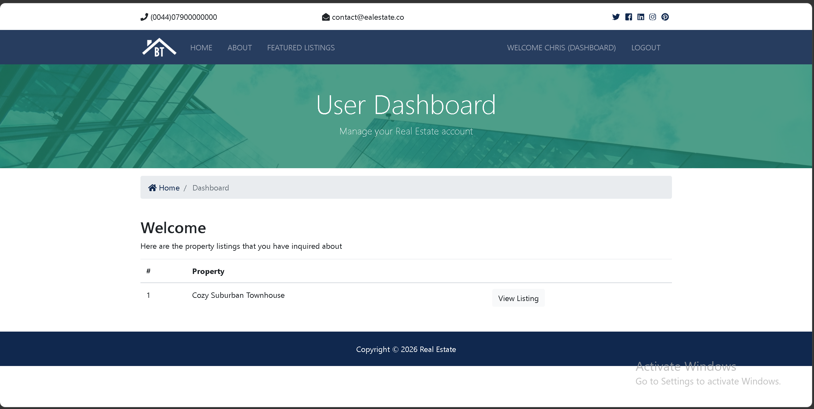

# Django Real Estate

A real estate web application built with Django.

The project allows users to browse property listings, view listing details, search for properties, contact realtors, register an account, log in, and view their inquiries through a user dashboard.

## Screenshots

### Home Page


### User Dashboard



## Features

* Property listings
* Listing detail pages
* Property search
* Realtor profiles
* Contact/inquiry form
* User registration
* User login/logout
* User dashboard
* Django admin panel
* PostgreSQL database support
* Media file support for listing images

## Tech Stack

* Python
* Django
* PostgreSQL
* Pillow
* Bootstrap
* HTML
* CSS
* JavaScript

## Project Structure

```text
django_real_estate/
├── accounts/
├── contacts/
├── listings/
├── pages/
├── realtors/
├── real_estate/
├── templates/
├── manage.py
├── requirements.txt
└── .gitignore
```

## Requirements

* Python 3.12
* PostgreSQL
* pip
* virtualenv

## Installation

Clone the repository:

```bash
git clone https://github.com/chrispsk/django_real_estate.git
cd django_real_estate
```

Create a virtual environment:

```bash
python -m venv .venv
```

Activate the virtual environment:

```bash
# Windows
.venv\Scripts\activate
```

```bash
# macOS / Linux
source .venv/bin/activate
```

Upgrade pip:

```bash
python -m pip install --upgrade pip
```

Install dependencies:

```bash
pip install -r requirements.txt
```

## Configuration

The project uses local configuration in:

```text
real_estate/settings.py
```

Before running the project, make sure the database settings match your local PostgreSQL setup.

Example PostgreSQL configuration:

```python
DATABASES = {
    "default": {
        "ENGINE": "django.db.backends.postgresql",
        "NAME": "realestate",
        "USER": "postgres",
        "PASSWORD": "your_database_password",
        "HOST": "localhost",
        "PORT": "5432",
    }
}
```

Email settings can also be configured in `settings.py` if you want to enable contact form email notifications.

For production, sensitive values such as `SECRET_KEY`, database passwords, and email credentials should be moved to environment variables and should not be committed to GitHub.

## Database Setup

Create a PostgreSQL database named:

```text
realestate
```

Then run migrations:

```bash
python manage.py makemigrations
python manage.py migrate
```

Create a superuser:

```bash
python manage.py createsuperuser
```

## Running the Project

Start the development server:

```bash
python manage.py runserver
```

Open the app in your browser:

```text
http://localhost:8000
```

Open the admin panel:

```text
http://localhost:8000/admin
```

## Main Apps

### Accounts

Handles user registration, login, logout, and dashboard functionality.

### Listings

Handles property listings, listing detail pages, and property search.

### Realtors

Stores and displays realtor information.

### Contacts

Handles property inquiry submissions from users interested in a property.

### Pages

Handles static pages such as the home page and about page.

## Common Commands

Run the development server:

```bash
python manage.py runserver
```

Create migrations:

```bash
python manage.py makemigrations
```

Apply migrations:

```bash
python manage.py migrate
```

Create an admin user:

```bash
python manage.py createsuperuser
```

Check the project for issues:

```bash
python manage.py check
```

## Notes

Before using it in production, you should:

* Set `DEBUG=False`
* Use a strong secret key
* Configure production database credentials
* Configure allowed hosts
* Serve the application over HTTPS
* Keep sensitive data out of GitHub

## License

This project is open source.
